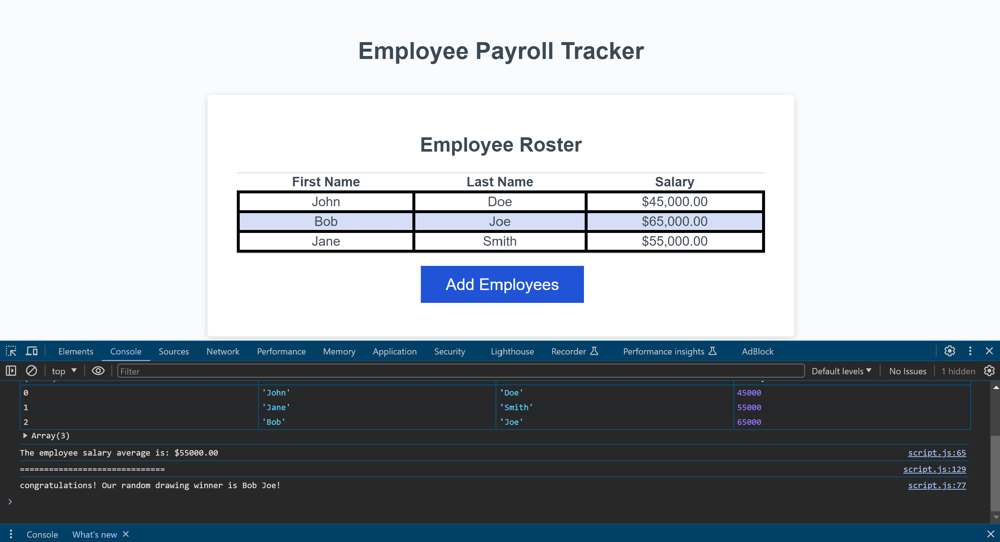

# Employee Payroll Tracker

## Description

After preexisting code for an employee payroll tracker was provided, additional JavaScript code was added for the application to function. This allows a payroll manager to compile their employee's payroll data, such as their first name, last name, and salary into an employee roster. The employee data is also alphabetically organized within the employee roster, which aids the payroll manager in managing their employee's data.

## Usage

Once the payroll manager clicks on the button to add an employee, they are then prompted to input the employee's first name, last name, and salary. Then the payroll manager is asked if they want to add another employee. If they choose to add another employee, then they are asked to input the new employee's information, otherwise, the names that were already added will be displayed in alphabetical order to the employee roster. When the Chrome DevTools is opened, the salary average and the name of a randomly selected employee will be displayed in the console. If more employees are added to the existing list of employees in the roster, then the table will be updated with the new employee’s data and the list will be organized once more to be in alphabetical order. The new salary average will also be displayed on the console along with the name of another random employee.

